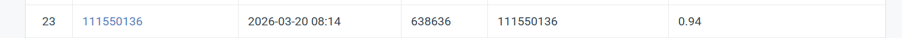
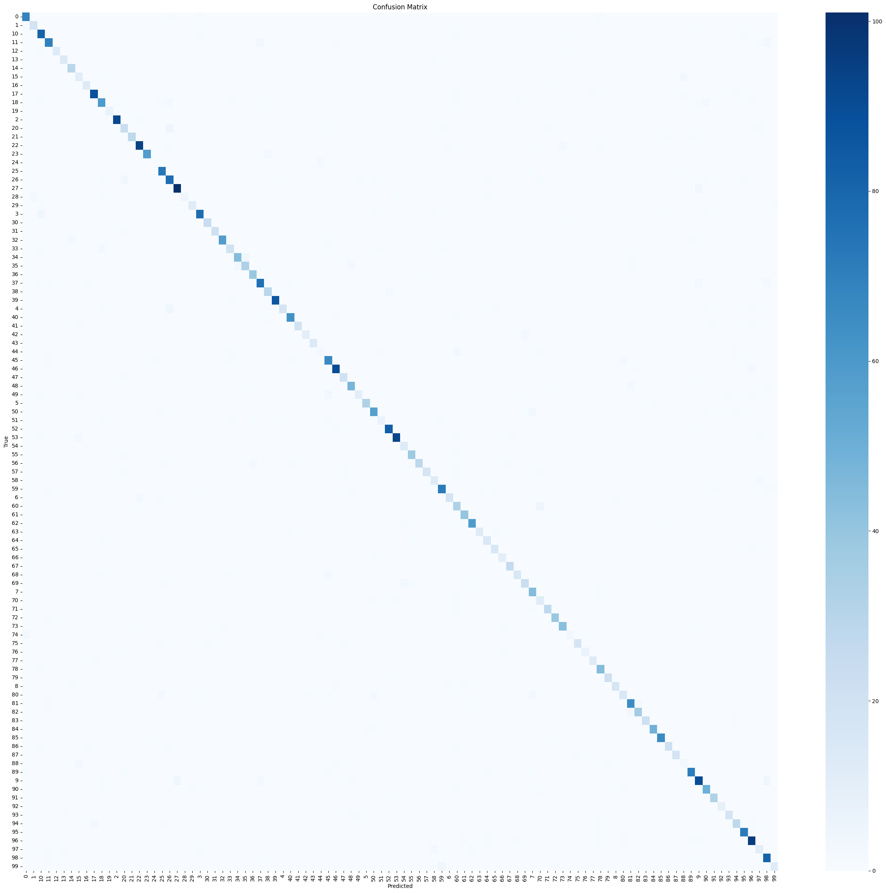

# NYCU Computer Vision 2026 HW1

- **Student ID:** 111550136
- **Name:** 連家堯

---

## Introduction

This project implements an image classification pipeline for a 100-class dataset using a fine-tuned **ResNet-101** backbone pretrained on ImageNet.

Key design choices:
- **Data augmentation**: RandomResizedCrop, HorizontalFlip, ColorJitter, RandomErasing
- **Training tricks**: Mixup + CutMix (50/50 random per batch), label smoothing (0.1)
- **Optimizer**: AdamW with differential learning rates (backbone 0.1×, head 1×)
- **Scheduler**: Linear warmup (5 epochs) → cosine decay

---

## Environment Setup

Python **3.9+** is required. Install all dependencies with:

```bash
pip install torch torchvision torchinfo numpy matplotlib seaborn scikit-learn tqdm Pillow
```

---

## Usage

This project is run on **Google Colab**.

### Mount Google Drive

Mount Google Drive to persist weights and results across sessions.

```python
from google.colab import drive
drive.mount('/content/drive')
import os
DRIVE_DIR = '/content/drive/MyDrive/hw1'
os.makedirs(DRIVE_DIR, exist_ok=True)
os.makedirs(f'{DRIVE_DIR}/weights', exist_ok=True)
os.makedirs(f'{DRIVE_DIR}/results', exist_ok=True)
print(f"Drive mounted. Working dir: {DRIVE_DIR}")
```

### Download Dataset

Download and extract the competition dataset using gdown.

```python
!pip install -q gdown
!gdown --id 1vxiXJHUo6ZPGxBGXwrsSut0pqfJ6HN9D -O cv_hw1_data.tar
!tar -xf cv_hw1_data.tar
print("Data ready!")
```

### Training

Run all cells in the notebook sequentially. The training will:
1. Load the dataset from `data/train`, `data/val`, `data/test`
2. Train ResNet-101 for 40 epochs
3. Save the best model to `weights/best_resnet101.pth`
4. Output training curves to `results/loss_accuracy.png`
5. Output confusion matrix to `results/confusion_matrix.png`
6. Save test predictions to `prediction.csv`

---

## Code

### Imports & Setup

Import all required libraries and detect whether a GPU is available. Dataset directory paths are also defined here.

```python
import csv
import math
import os
import warnings

import matplotlib.pyplot as plt
import numpy as np
import seaborn as sns
import torch
import torch.nn as nn
import torch.optim as optim

from PIL import Image
from sklearn.metrics import confusion_matrix
from torch.optim.lr_scheduler import _LRScheduler
from torch.utils.data import DataLoader, Dataset
from torchinfo import summary
from torchvision import transforms, models
from tqdm import tqdm
from typing import Optional, Tuple

warnings.filterwarnings("ignore")

DEFAULT_DEVICE = 'cuda' if torch.cuda.is_available() else 'cpu'
print("PyTorch:", torch.__version__)
print("Device:", DEFAULT_DEVICE)

DATA_ROOT = "data"
TRAIN_DIR = "data/train"
VAL_DIR   = "data/val"
TEST_DIR  = "data/test"
```

### Transforms

Define two separate transform pipelines. The training pipeline applies aggressive stochastic augmentation to improve generalisation. The evaluation pipeline uses only deterministic resizing and cropping to ensure consistent, unbiased measurement.

```python
IMG_SIZE    = 224
NUM_CLASSES = 100

IMAGENET_MEAN = (0.485, 0.456, 0.406)
IMAGENET_STD  = (0.229, 0.224, 0.225)

train_transform = transforms.Compose([
    transforms.RandomResizedCrop(IMG_SIZE, scale=(0.5, 1.0), ratio=(0.75, 1.33)),
    transforms.RandomHorizontalFlip(p=0.5),
    transforms.RandomVerticalFlip(p=0.1),
    transforms.RandomRotation(degrees=20),
    transforms.ColorJitter(brightness=0.3, contrast=0.3, saturation=0.3, hue=0.1),
    transforms.RandomGrayscale(p=0.02),
    transforms.ToTensor(),
    transforms.Normalize(IMAGENET_MEAN, IMAGENET_STD),
    transforms.RandomErasing(p=0.25, scale=(0.02, 0.2)),
])

eval_transform = transforms.Compose([
    transforms.Resize(int(IMG_SIZE * 256 / 224)),
    transforms.CenterCrop(IMG_SIZE),
    transforms.ToTensor(),
    transforms.Normalize(IMAGENET_MEAN, IMAGENET_STD),
])
```

### Dataset Classes

Three dataset classes are defined. `ImageFolderDataset` loads labeled images from a class-folder structure. `_ValWrapper` wraps a random split subset and applies eval transforms instead of train transforms to avoid data leakage. `TestDataset` loads unlabeled test images and returns the filename instead of a label.

```python
class ImageFolderDataset(Dataset):
    IMG_EXT = {".jpg", ".jpeg", ".png"}

    def __init__(self, root: str, transform=None):
        self.root = root
        self.transform = transform
        self.samples = []
        self.classes = sorted(
            d for d in os.listdir(root)
            if os.path.isdir(os.path.join(root, d))
        )
        self.class_to_idx = {c: i for i, c in enumerate(self.classes)}
        for cls in self.classes:
            cls_dir = os.path.join(root, cls)
            for fname in os.listdir(cls_dir):
                if os.path.splitext(fname)[1].lower() in self.IMG_EXT:
                    self.samples.append(
                        (os.path.join(cls_dir, fname), self.class_to_idx[cls])
                    )

    def __len__(self):
        return len(self.samples)

    def __getitem__(self, idx):
        path, label = self.samples[idx]
        img = Image.open(path).convert("RGB")
        if self.transform:
            img = self.transform(img)
        return img, label


class _ValWrapper(Dataset):
    def __init__(self, subset, transform):
        self.subset = subset
        self.transform = transform

    def __len__(self):
        return len(self.subset)

    def __getitem__(self, idx):
        real_idx = self.subset.indices[idx]
        path, label = self.subset.dataset.samples[real_idx]
        img = Image.open(path).convert("RGB")
        return self.transform(img), label


class TestDataset(Dataset):
    IMG_EXT = {".jpg", ".jpeg", ".png"}

    def __init__(self, root: str, transform=None):
        self.transform = transform
        self.paths = sorted(
            p for p in [os.path.join(root, f) for f in os.listdir(root)]
            if os.path.isfile(p)
            and os.path.splitext(p)[1].lower() in self.IMG_EXT
        )

    def __len__(self):
        return len(self.paths)

    def __getitem__(self, idx):
        path = self.paths[idx]
        img = Image.open(path).convert("RGB")
        if self.transform:
            img = self.transform(img)
        return img, os.path.basename(path)
```

### DataLoader Factory

`get_loaders` builds train, val, and test DataLoaders. If the provided `data/val` directory is large enough (≥1000 images), it is used directly. Otherwise, 25% of the training data is randomly split off as the validation set.

```python
MIN_VAL_SIZE = 1000


def get_loaders(
    batch_size: int = 32,
    val_split: float = 0.25,
    num_workers: int = 4,
) -> Tuple[DataLoader, DataLoader, Optional[DataLoader]]:

    loader_kw = dict(num_workers=num_workers, pin_memory=True)
    full_ds = ImageFolderDataset("data/train", transform=train_transform)

    _presplit_ok = (
        os.path.isdir("data/val")
        and len(os.listdir("data/val")) > 0
        and len(ImageFolderDataset("data/val")) >= MIN_VAL_SIZE
    )
    if _presplit_ok:
        train_ds = full_ds
        val_ds = ImageFolderDataset("data/val", transform=eval_transform)
        print(f"Using pre-split val dir: {len(val_ds)} images")
    else:
        val_len = int(len(full_ds) * val_split)
        train_len = len(full_ds) - val_len
        train_split, val_split_raw = torch.utils.data.random_split(
            full_ds, [train_len, val_len]
        )
        train_ds = train_split
        val_ds = _ValWrapper(val_split_raw, eval_transform)
        print(f"Random split → train: {len(train_ds)}, val: {len(val_ds)}")

    train_loader = DataLoader(train_ds, batch_size=batch_size, shuffle=True,  **loader_kw)
    val_loader   = DataLoader(val_ds,   batch_size=batch_size, shuffle=False, **loader_kw)
    test_ds      = TestDataset("data/test", transform=eval_transform)
    test_loader  = DataLoader(test_ds,  batch_size=batch_size, shuffle=False, **loader_kw)
    print(f"Test: {len(test_ds)} images")
    print(f"Train: {len(train_ds)} | Val: {len(val_ds)} | Val batches: {len(val_loader)}")
    return train_loader, val_loader, test_loader
```

### Model — ResNet-101

Load ResNet-101 with ImageNet pretrained weights and replace the final fully connected layer with a Dropout + Linear head for 100-class classification. Weight initialisation is changed from Kaiming Uniform to Kaiming Normal and bias is set to zero for a more stable training start.

```python
def build_resnet101(
    num_classes: int = 100,
    pretrained: bool = True,
    dropout: float = 0.4,
) -> nn.Module:
    weights = models.ResNet101_Weights.IMAGENET1K_V2 if pretrained else None
    model = models.resnet101(weights=weights)

    in_features = model.fc.in_features
    model.fc = nn.Sequential(
        nn.Dropout(p=dropout),
        nn.Linear(in_features, num_classes),
    )
    nn.init.kaiming_normal_(model.fc[1].weight, mode="fan_out", nonlinearity="relu")
    nn.init.zeros_(model.fc[1].bias)
    return model
```

### Utilities (Mixup / CutMix / Plotting)

Helper functions for data mixing and visualisation. `mixup_data` blends two images linearly. `cutmix_data` replaces a rectangular region of one image with a patch from another. Both return mixed labels proportional to the mixing ratio. `plot_loss_accuracy` and `plot_confusion_matrix` save training curves and the confusion matrix to the results folder.

```python
def mixup_data(x, y, alpha=0.4):
    lam = np.random.beta(alpha, alpha) if alpha > 0 else 1.0
    idx = torch.randperm(x.size(0), device=x.device)
    return lam * x + (1 - lam) * x[idx], y, y[idx], lam


def mixup_criterion(criterion, pred, y_a, y_b, lam):
    return lam * criterion(pred, y_a) + (1 - lam) * criterion(pred, y_b)


def cutmix_data(x, y, alpha=1.0):
    lam = np.random.beta(alpha, alpha)
    idx = torch.randperm(x.size(0), device=x.device)
    w, h = x.size(3), x.size(2)
    cut_ratio = np.sqrt(1 - lam)
    cut_w, cut_h = int(w * cut_ratio), int(h * cut_ratio)
    cx, cy = np.random.randint(w), np.random.randint(h)
    x1, y1 = max(cx - cut_w // 2, 0), max(cy - cut_h // 2, 0)
    x2, y2 = min(cx + cut_w // 2, w), min(cy + cut_h // 2, h)
    x_mix = x.clone()
    x_mix[:, :, y1:y2, x1:x2] = x[idx, :, y1:y2, x1:x2]
    lam = 1 - (x2 - x1) * (y2 - y1) / (w * h)
    return x_mix, y, y[idx], lam


def plot_loss_accuracy(train_loss, train_acc, val_loss, val_acc,
                       filename="results/loss_accuracy.png"):
    fig, (ax1, ax2) = plt.subplots(1, 2, figsize=(12, 4))
    ax1.plot(train_loss, label="Train"); ax1.plot(val_loss, label="Val")
    ax1.set(xlabel="Epoch", ylabel="Loss", title="Loss"); ax1.legend()
    ax2.plot(train_acc, label="Train"); ax2.plot(val_acc, label="Val")
    ax2.set(xlabel="Epoch", ylabel="Accuracy", title="Accuracy"); ax2.legend()
    fig.tight_layout()
    os.makedirs(os.path.dirname(filename) or ".", exist_ok=True)
    plt.savefig(filename, dpi=150)
    print(f"Plot → {filename}")


def plot_confusion_matrix(conf_matrix, classes, filename="results/confusion_matrix.png"):
    n = len(classes)
    plt.figure(figsize=(max(12, n // 4), max(10, n // 4) - 2))
    sns.heatmap(conf_matrix, annot=(n <= 20), fmt="d", cmap="Blues",
                xticklabels=classes, yticklabels=classes)
    plt.xlabel("Predicted"); plt.ylabel("True"); plt.title("Confusion Matrix")
    plt.tight_layout()
    os.makedirs(os.path.dirname(filename) or ".", exist_ok=True)
    plt.savefig(filename, dpi=100)
    print(f"Confusion matrix → {filename}")
```

### LR Scheduler

A custom scheduler that linearly increases the learning rate from 0 to the base LR over the first `warmup_epochs`, then applies cosine decay down to `min_lr` for the remaining epochs. This prevents instability at the start of training and allows fine-grained updates in later epochs.

```python
class WarmupCosineScheduler(_LRScheduler):
    def __init__(self, optimizer, warmup_epochs, total_epochs, min_lr=1e-6, last_epoch=-1):
        self.warmup_epochs = warmup_epochs
        self.total_epochs  = total_epochs
        self.min_lr        = min_lr
        super().__init__(optimizer, last_epoch)

    def get_lr(self):
        if self.last_epoch < self.warmup_epochs:
            scale = (self.last_epoch + 1) / max(1, self.warmup_epochs)
            return [base_lr * scale for base_lr in self.base_lrs]
        progress = (self.last_epoch - self.warmup_epochs) / \
                   max(1, self.total_epochs - self.warmup_epochs)
        cosine = 0.5 * (1.0 + math.cos(math.pi * progress))
        return [self.min_lr + (base_lr - self.min_lr) * cosine for base_lr in self.base_lrs]
```

### Evaluate

Run the model on a dataloader in evaluation mode (no gradient updates) and return the average loss, top-1 accuracy, and confusion matrix. Used after every epoch to monitor validation performance.

```python
def evaluate(model, dataloader, criterion, device=DEFAULT_DEVICE):
    model.eval()
    running_loss, total, correct = 0.0, 0, 0
    all_preds, all_labels = [], []

    with torch.no_grad():
        for batch in tqdm(dataloader, desc="Evaluating", leave=True):
            images, labels = batch[0].to(device), batch[1]
            if not isinstance(labels, torch.Tensor):
                continue
            labels = labels.to(device)
            output = model(images)
            loss   = criterion(output, labels)
            predicted = output.argmax(1)
            running_loss += loss.item()
            total        += labels.size(0)
            correct      += (predicted == labels).sum().item()
            all_preds.extend(predicted.cpu().numpy())
            all_labels.extend(labels.cpu().numpy())

    avg_loss = running_loss / max(len(dataloader), 1)
    accuracy = correct / max(total, 1) * 100
    conf_mat = confusion_matrix(all_labels, all_preds) if all_labels else None
    return avg_loss, accuracy, conf_mat
```

### Training Loop

The main training function. At each iteration, Mixup or CutMix is randomly selected with 50/50 probability. AdamW is used with a differential learning rate (backbone at 0.1× LR, head at full LR). The best model checkpoint is saved whenever validation accuracy improves.

```python
def train_model(
    model, train_loader, val_loader,
    epochs=40, lr=1e-3, device=DEFAULT_DEVICE,
    save_path="./weights/best_resnet101.pth",
):
    model.to(device)
    backbone_params = [p for n, p in model.named_parameters() if "fc" not in n]
    head_params     = list(model.fc.parameters())
    optimizer = optim.AdamW([
        {"params": backbone_params, "lr": lr * 0.1},
        {"params": head_params,     "lr": lr},
    ], weight_decay=1e-4)
    criterion = nn.CrossEntropyLoss(label_smoothing=0.1)
    scheduler = WarmupCosineScheduler(optimizer, warmup_epochs=5, total_epochs=epochs)

    best_val_acc = 0.0
    train_loss_hist, train_acc_hist, val_loss_hist, val_acc_hist = [], [], [], []

    for epoch in range(epochs):
        model.train()
        running_loss, correct, total = 0.0, 0, 0
        pbar = tqdm(train_loader, desc=f"Epoch {epoch+1}/{epochs}")

        for images, labels in pbar:
            images, labels = images.to(device), labels.to(device)
            if np.random.rand() < 0.5:
                images, y_a, y_b, lam = cutmix_data(images, labels, alpha=1.0)
            else:
                images, y_a, y_b, lam = mixup_data(images, labels, alpha=0.4)

            optimizer.zero_grad()
            outputs = model(images)
            loss    = mixup_criterion(criterion, outputs, y_a, y_b, lam)
            loss.backward()
            nn.utils.clip_grad_norm_(model.parameters(), max_norm=1.0)
            optimizer.step()

            running_loss += loss.item() * images.size(0)
            correct      += outputs.argmax(1).eq(y_a).sum().item()
            total        += labels.size(0)
            pbar.set_postfix(loss=f"{running_loss/total:.4f}")

        epoch_loss = running_loss / total
        epoch_acc  = correct / total
        val_loss, val_acc, _ = evaluate(model, val_loader, criterion, device)

        train_loss_hist.append(epoch_loss); train_acc_hist.append(epoch_acc)
        val_loss_hist.append(val_loss);     val_acc_hist.append(val_acc / 100.0)

        print(f"[{epoch+1:>3}/{epochs}] "
              f"Train {epoch_loss:.4f}/{epoch_acc*100:.2f}%  "
              f"Val {val_loss:.4f}/{val_acc:.2f}%  "
              f"LR {scheduler.get_last_lr()[0]:.2e}")

        if val_acc > best_val_acc:
            best_val_acc = val_acc
            save_model(model, save_path, existed="overwrite")
        scheduler.step()

    plot_loss_accuracy(train_loss_hist, train_acc_hist, val_loss_hist, val_acc_hist)
    print(f"\nBest Val Acc: {best_val_acc:.2f}%")
    return model
```

### Generate Test Predictions

Run the best saved model on the test set and write predictions to `prediction.csv`. Class indices are mapped back to the original folder names to correct for lexicographic sort order (e.g. index 2 → class `"10"`, not `"2"`).

```python
def generate_predictions(model, test_loader, idx_to_class,
                         output_csv="prediction.csv", device=DEFAULT_DEVICE):
    model.eval()
    rows = []
    with torch.no_grad():
        for batch in tqdm(test_loader, desc="Predicting"):
            images, meta = batch[0].to(device), batch[1]
            preds = model(images).argmax(1).cpu().numpy()
            ids   = meta.numpy() if isinstance(meta, torch.Tensor) else list(meta)
            for id_, pred in zip(ids, preds):
                rows.append((os.path.splitext(id_)[0], idx_to_class[int(pred)]))

    with open(output_csv, "w", newline="") as f:
        writer = csv.writer(f)
        writer.writerow(["image_name", "pred_label"])
        writer.writerows(rows)
    print(f"Predictions saved → {output_csv} ({len(rows)} rows)")
```

### Run Everything

Entry point that ties all components together: load data, build and train the model, evaluate on validation set, plot results, and generate the submission CSV.

```python
if __name__ == "__main__":
    BATCH_SIZE    = 32
    EPOCHS        = 40
    LEARNING_RATE = 1e-3

    train_loader, val_loader, test_loader = get_loaders(batch_size=BATCH_SIZE)

    model = build_resnet101(num_classes=NUM_CLASSES, pretrained=True)
    model = train_model(model, train_loader, val_loader,
                        epochs=EPOCHS, lr=LEARNING_RATE,
                        save_path="./weights/best_resnet101.pth")

    criterion  = nn.CrossEntropyLoss(label_smoothing=0.1)
    best_model = build_resnet101(num_classes=NUM_CLASSES, pretrained=False)
    best_model = load_model(best_model, "./weights/best_resnet101.pth")
    best_model.to(DEFAULT_DEVICE)

    val_loss, val_acc, conf_mat = evaluate(best_model, val_loader, criterion)
    print(f"Val Accuracy: {val_acc:.2f}% | Loss: {val_loss:.4f}")

    _ds = train_loader.dataset
    class_names = _ds.classes if hasattr(_ds, "classes") else _ds.dataset.classes
    if conf_mat is not None:
        plot_confusion_matrix(conf_mat, class_names)

    train_class_to_idx = (_ds.class_to_idx if hasattr(_ds, "class_to_idx")
                          else _ds.dataset.class_to_idx)
    idx_to_class = {v: k for k, v in train_class_to_idx.items()}
    generate_predictions(best_model, test_loader, idx_to_class)
```

---

## Performance Snapshot



### Confusion Matrix


